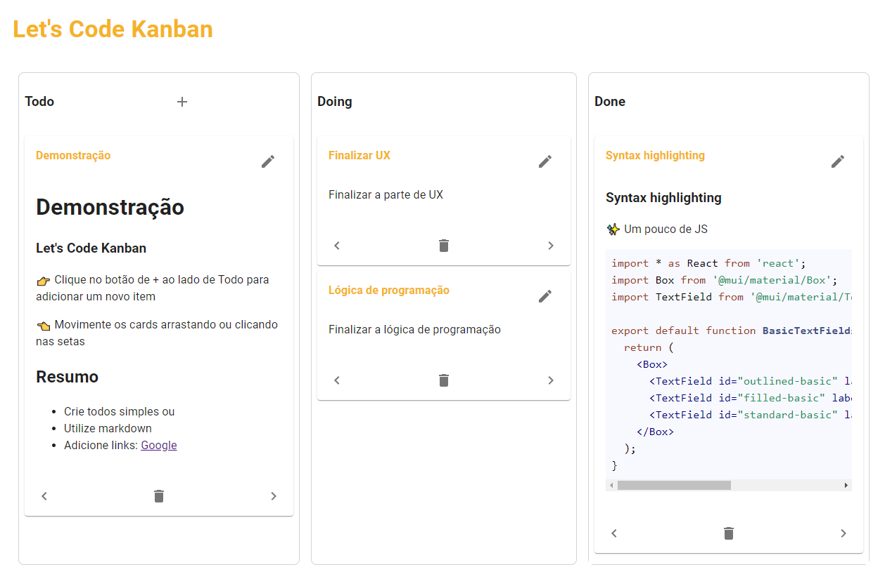

# Let's Code 

## Desafio Técnico - Frontend



## Rodando o projeto

Front e back estão desacoplados, é necessário rodar os dois separadamente
### Backend para Testes

Para executar o backend faça:

```console
> cd BACK
> npm install
> npm run server
```

Ele responderá às requisições em http://localhost:5000.

### Frontend

Para executar o front execute na pasta raiz:

```console
> yarn
> yarn start
```

Projeto será inicializado em http://localhost:3000.

### Node e npm -v
```console
> node -v  v16.15.0
> npm -v 8.5.5
```

## Detalhes do projeto

- Quadro de Kanban com 3 colunas e cards
- É possível movimentar os cards utilizando as setas OU arrastando os cards
- Foi utilizado a lib react-beautiful-dnd para o drag and drop.
- Os cards podem ser visualizados e editados
- Os cards devem aceitar Markdown
- Utilizado Material UI + Emotion para Design System e estilização
- Devido ao Drag and Drop, parte da lógica deve ficar mais complexa do que se utilizando apenas a navegação por setas
- Login deve ocorrer de maneira automática em services/api pelo interceptor do axios
- Kanban será populado sempre que estiver vazio e renderizar pela primeira vez (ou sofrer um F5)
- A posição dos cards nas colunas não é persistente. Há duas simples soluções, salvar o state do column.taskIds no localStorage/cache OU no backend
- Todo: Adicionar tratativas de erros e notificações; Melhorar tipagems;